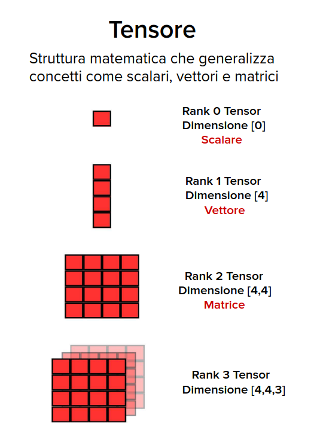

### Che cos'è un modello di esecuzione e a che cosa serve?
In generale, un modello di esecuzione fornisce una visione operativa di come le istruzioni vengono eseguite su una specifica architettura di calcolo (nel nostro caso, le GPU).

Importanza:
- Offre una visione unificata dell'esecuzione su diverse GPU.
- Fornisce indicazioni utili per l'ottimizzazione del codice in termini di:
    - Throughput delle istruzioni.
    - Accessi alla memoria.
    - Facilita la comprensione della relazione tra il modello di programmazione e __l'esecuzione effettiva__.

## Streaming multiprocessor
Una GPU è composta da tanta roba, ad esempio:
- memory controller
    - controllore per gli accessi alla memoria, multipli per suddivisione dell'accesso alla memoria globale (del device)
- giga thread engine
    - scheduler dei blocchi verso i multiprocessori della GPU
- streaming multiprocessor
    - una GPU è composta da tanti SM (16 nell'esempio, al giorno d'oggi anche 144). Ogni SM si occuperà di lanciare i thread definiti nella griglia.

Gli Streaming Multiprocessors (SM) sono le __unità fondamentali di elaborazione__ all'interno delle GPU. Ogni SM contiene diverse unità di calcolo, memoria condivisa e altre risorse essenziali per gestire l'esecuzione concorrente e parallela di migliaia di thread. Il parallelismo hardware delle GPU è ottenuto attraverso la replica di questo blocco architetturale.

Il singolo SM è a sua volta composto da tanta roba:
- Cuda cores
    - unità di elaborazione che eseguono le istruzioni; composte da ALU, FPU (Floating Point Unit, alu per float), ecc...
- Special Function Units (SFU)
    - Accelerano calcoli matematici complessi. Come seno coseno, ecc...
- Register files
    - memoria __privata di ogni thread__ per dati temporanei.
- Warp scheduler
    - Coordinano l'esecuzione dei thread sui diversi core CUDA.
    - I warp sono  gruppi di 32 thread con cui vengono suddivisi i blocchi
- Dispatch units    
    - Assegna i thread selezionati dal warp scheduler ai core CUDA.
    - Simile alla Control Unit di una CPU, gestisce l'attivazione di ALU, FPU dei Cuda core.
    - ad es. se arriva una istruzione di somma, la DU attiva tutte le unità necessarie per eseguire l'istruzione
- Load/Store units
    - Gestiscono il trasferimento dati da/verso la memoria.
- Shared Memory/L1 Cache
    - Memoria ad alta velocità __condivisa tra tutti i thread di un blocco__.
- Instruction Cache
    - Memorizza temporaneamente le istruzioni usate di frequente.

### Cuda core
Un CUDA Core è l'unità di elaborazione di base all'interno di un SM di una GPU NVIDIA. 

    Ruolo nel Modello CUDA: esecuzione Parallela! Ogni CUDA Core esegue un thread in parallelo con altri nel medesimo SM.

I CUDA Core usano __registri condivisi a livello di Streaming Multiprocessor__ per memorizzare temporaneamente dati durante l'esecuzione dei thread.

Inizialmente, i CUDA Core erano unità di elaborazione relativamente semplici, in grado di eseguire sia operazioni intere (INT) che in virgola mobile (FP) in un ciclo di clock (fully pipelined). L'architettura e la funzionalità dei CUDA Core sono evolute nel tempo, passando __da unità generiche__(operazioni con interi e float nello stesso core) a unità __specializzate__.

NB: oggigiorno con cuda core si intendono solo le unita FP32 non anche il resto tipo tensor core.

Dall'architettura Kepler, NVIDIA ha introdotto la specializzazione delle unità di calcolo (cuda core) __all'interno di uno SM__:
- Unità FP64: Dedicate alle operazioni in virgola mobile a doppia precisione.
- Unità FP32: Dedicate alle operazioni in virgola mobile a singola precisione.
- Unità INT: Dedicate alle operazioni intere.
- __Tensor Core (TC)__ ( Architettura Volta e successive): Unità specializzate particolarmente ottimizzate per moltiplicazioni fra matrici (tensoriale=array multidimensionali) in precisione ridotta/mista (FP32, FP16, TF32, INT8, etc.).
- Ray Tracing Core (RT) (Ampere e successive): Unità dedicate per l'accelerazione del ray tracing.
- Unità di Texture: Ottimizzate per gestire texture e operazioni di filtraggio.
- Unità di Rasterizzazione: Utilizzate per la rasterizzazione delle immagini durante il rendering.

#### Differenze dei Cuda core rispetto ai core delle CPU:
- Semplicità Architetturale: Le varie unità di gestione all’interno di un SM sono più semplici rispetto ai core delle CPU, __senza unità di controllo complesse__, permettendo una maggiore densità di unità specializzate.
    - NB: unità di controllo semplici implicano:
        - Emissione delle istruzioni in ordine
        - Nessuna branch prediction
        - Nessuna esecuzione speculativa
- Specializzazione: Mentre le CPU sono general purpose, le GPU, attraverso i CUDA Core e le unità specializzate,
offrono performance elevate anche per compiti specifici come l'Intelligenza Artificale, il rendering grafico.

### Streaming Multiprocessor - Evoluzione
- Aumento di SM e CUDA Core: Ogni generazione ha generalmente aumentato il numero di SM e CUDA Core.
- Miglioramento del Parallelismo: L'aumento dei CUDA Core permette un __maggiore parallelismo__, migliorando le prestazioni complessive della GPU.
- Calcolo CUDA Core Totali: Totale CUDA Core = (SM per GPU) × (CUDA Core per SM)
- Calcolo Throughput Teorico: Throughput FP32 = Totale CUDA Cores FP32 × 2 × Frequenza di clock. (x2 in quanto si hanon 2 operazioni FP32/ciclo, e.g. Fused Multiply-Add))

Gli SM nelle architetture più recenti sono anche poi partizionati.